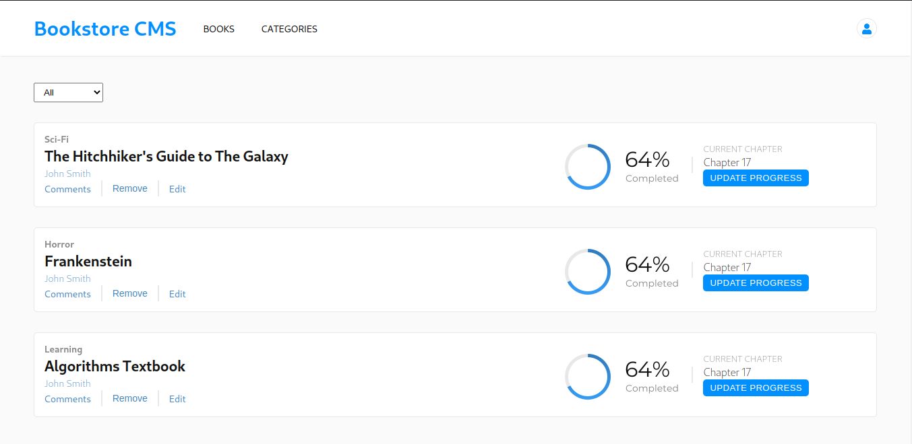

# Bookstore

> This is a bookstore frontend built with React and Redux.

## Built With

- Javascript
- React/Redux
- Node

## Live Demo

[Live Demo Link](https://quiet-wildwood-41479.herokuapp.com/)

## Getting Started

To get a local copy up and running follow these simple example steps.

### Prerequisites

npm

### Setup

Clone this repo by running `git clone git@github.com:meronokbay/bookstore.git`.

### Install

`cd` into the cloned repo and run `npm install`.

### Usage

Run `npm start` to view the app in your default browser.

## Author

👤 **Meron Ogbai**

- Github: [@meronokbay](https://github.com/meronokbay)
- Twitter: [@MeronDev](https://twitter.com/MeronDev)
- Linkedin: [Meron Ogbai](https://linkedin.com/in/meron-ogbai/)

## 🤝 Contributing

Contributions, issues, and feature requests are welcome!

## Show your support

Give a ⭐️ if you like this project!

## 📝 License

This project is [MIT](./LICENSE) licensed.
